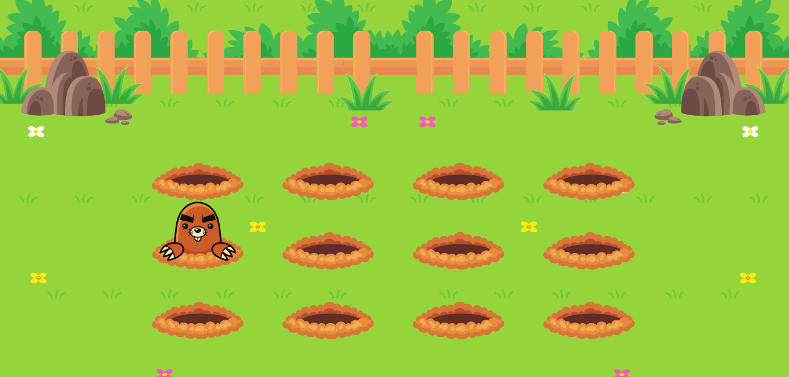

<h1 align="center"> Stage 03 - Desafio das Toupeiras</h1>

  <a href="#-tecnologias">Tecnologias</a>&nbsp;&nbsp;&nbsp;|&nbsp;&nbsp;&nbsp;
  <a href="#-projeto">Projeto</a>&nbsp;&nbsp;&nbsp;|&nbsp;&nbsp;&nbsp;
  <a href="https://gabriel-adsv.github.io/stage03-desafio-das-toupeiras/" target="_blank">Layout</a>&nbsp;&nbsp;&nbsp;|&nbsp;&nbsp;&nbsp;
  <a href="#memo-licença">Licença</a>

  

<strong>Projeto desenvolvido no nível 3 das aulas da trilha Explorer da Rocketseat.</strong> 
Neste desafio, foram aplicados os conhecimentos animação no CSS.

 

  

## 🚀 Tecnologias
Esse projeto foi desenvolvido com as seguintes tecnologias:
- HTML
- CSS
- Animações com keyframes

## 💻 Projeto
Atividade feita no Stage 06 do curso Explorer da Rocketseat. Onde é feito uma página utilizando SPA.

- [Acesse o projeto finalizado, online](https://gabriel-adsv.github.io/stage03-desafio-das-toupeiras/)

## 📧 Contato
- gabriel.aug.dsv@gmail.com

## 📝 Licença
Esse projeto está sob a licença MIT.

---
Desenvolvido por Gabriel Augusto
